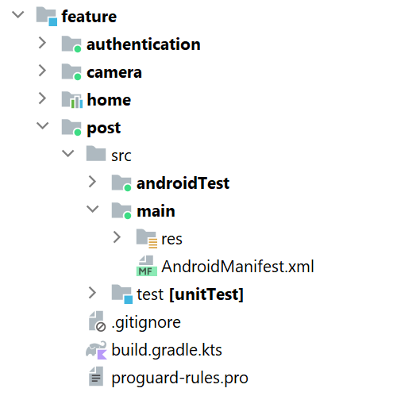

# TINYREEL - GROUP 3

## Cách một ứng dụng Android chạy

- B1: Đọc file Manifest.xml
- B2: Tìm trong tag `application` xem có chỉ định đối tượng **Application** nào không? - Sẽ chỉ định lại thông qua `android:name = ...` 
> Đối tượng **Application** là đối tượng kế thừa `Application` có nhiệm vụ quản lý toàn bộ ứng dụng.

- B3: Nếu không chỉ định lại thì dùng mặc định của Android. Nếu có thì sử dụng lớp được chỉ định này (ở trong ứng dụng của mình có chỉ định lại `android:name=".MyApp"`)

- B4: Khởi tạo đối tượng **Application** và các ràng buộc (dependency) được chỉ định cho toàn ứng dụng được khai báo trong đối tượng này 

>(ở app của mình là `@Hilt` dùng để Dependency Inject. Để dùng được thì phải implement dependency `com.google.dagger:hilt-android:xxxx` )

- B5: Tìm Activity khởi động - là Activity có nhãn `MAIN` và `LAUNCHER`. 

## Thêm các màu trong file `Theme/Color.kt`

Vì định nghĩa các màu này cần dùng tới hàm `Color()` trong gói `androidx.compose.ui.graphics.Color` nên chúng ta cần phải implement `"androidx.compose.ui:ui:xxxx"` (với xxxx là phiên bản được chọn).

- B1: Vào **file** --> **project structure** --> **dependency** 
- B2: Chọn module muốn add dependency vào (chọn module `theme`)
- B3: Nhấn dấu `+`, search `com.google.dagger:hilt-android:*` và chọn phiên bản
- B4: Nhấn **Apply**

## Thêm font vào file `Theme/Font.kt`

- B1: Tải các font cần thiết về và để trong thư mục **font** ở **res**
- B2: Tạo file Font.kt giống như trên github

## Thêm các style của chữ vào file `Theme\Type.kt`

Cần imlement `androidx.compose.material3:material3:xxxx`

## Thêm các theme vào file `Theme\theme.kt`

Thêm theme dark và light vào

## Thêm folder `extension` trong `core` và 2 file `Extension.kt` và `Space.kt`

Trong **main** của **core** tạo java folder.  
Trong java folder tạo package `com.example.core.extension`.  
Trong package tạo 2 file `Extension.kt` và `Space.kt`.

## Để các file trong module `app` dùng được cách hàm được định nghĩa ở module khác.

Cách làm: Chuyển các module khác về dạng `library` và sau đó module `app` implementation các `library` này.

- B1: Chuyển các module về dạng `library`. 
    - Nhìn chung thì `library` và `module` có cấu trúc giống hệt nhau. Ta chỉ cần sửa trong file `gradle.build.kts`
    - Sửa: 
    >       plugins {
    >           id("com.android.application")
    >       }

    Thành 

    >       plugins {
    >           id("com.android.library")
    >       }

    - Trong default config, xóa các dòng:
    >       applicationId = "com.example.profile"
    >       targetSdk = 34
    >       versionCode = 1
    >       versionName = "1.0"

    - Chỉ để lại:
    >       minSdk = 28
    >       testInstrumentationRunner = "androidx.test.runner.AndroidJUnitRunner"

- B2: Vào **file** --> **project structure** --> **Dependencies**
- B3: Chọn module **app**
- B4: Nhấn dấu `+` và chọn `Module Dependency`
- B5: Chọn `module` muốn implementation và nhấn `apply`

## Cách tạo 1 package và thêm 1 file

Ví dụ tạo một file `PostScreen.kt` trong module **post**
- B1: Vào góc nhìn project
- B2: Vào folder **main** của module **post**


- B3: Tạo một java folder 


- B4: Tạo một package trong java folder (đặt tên package là gì cũng được vd: `com.example.post`)


- B5: Tạo file `PostScreen.kt` trong package này

> |  

------------
------------
> |

# ROOTSCREEN

`MainActivity` sẽ gọi `RootScreen` - Đây là cái khung để hiển thị nội dung. 

Trong `RootScreen` có 3 phần chính:
- TopBar : Thanh hiển thị thông tin ở trên cùng của ứng dụng (ngay dưới thanh trạng thái - hiển thị mức pin, wifi,... của điện thoại) - Đối với ứng dụng của mình thì **không có TopBar**
- BottomBar : Thanh hiển thị các thông tin ở dưới cùng của ứng dụng (ngay trên thanh điều hướng của điện thoại) - Đối với ứng dụng của mình thì `BottomBar` làm nhiệm vụ là 1 **thanh điều hướng**
- Content : Nội dung được hiển thị ở chính giữa màn hình - giữa TopBar và BottomBar


Đối với ứng dụng TinyReel, chúng ta có nhiều màn hình để hiển thị, nhưng thực chất chỉ là thay đổi nội dung hiển thị tại **Content** của `RootScreen` mà thôi. Nghĩa là khi chuyển hướng tới một ứng dụng khác thì giao diện được hiển thị trong **Content** sẽ thay đổi.

Cụ thể, được thể hiện trong code sau:
```
Scaffold(
    topBar = {

    },
    bottomBar = {
        if (!isShowBottomBar) {
            return@Scaffold
        }
    BottomBar(navController, currentDestination, isDarkTheme = darkMode)
    }
) {
    Column(
        modifier = Modifier
                .fillMaxSize()
                .padding(it)
        ) {
        
        // Content of Screen
        AppNavHost(navController = navController)
        }
    }
```

- `TopBar` được để trống
- `BottomBar` show khi cờ **isShowBottomBar** được bật. `BottomBar` được khởi tạo bởi hàm **BottomBar(...)**
- `Content` của **RootScreen** được đặt trong 1 **Column** với **fillMaxSize()** để nó chiếm hết không gian của màn hình. Và nội dung hiển thị sẽ được quản lý bởi **AppNavHost**.


`AppNavHost` là một đối tượng dùng để gọi các hàm để hiển thị các màn hình tương ứng với sự chuyển hướng của người dùng. Khi người dùng chuyển hướng sang một màn hình nào đó, thì `AppNavHost` sẽ gọi hàm tương ứng để hiển thị giao diện của màn hình đó lên.

## Khởi tạo UI cho RootScreen

Cụ thể UI của RootScreen được khởi tạo trong code sau và thể hiện các thành phần như hình:


Các câu lệnh phía trên dùng để khởi tạo các biến dùng cho RootScreen.

## Giải thích cụ thể các thành phần trong UI của RootScreen

### `SetUpSystemUI()` - Đổi màu cho 2 thanh trạng thái của điện thoại (thanh hiển thị pin với thanh điều hướng)

```
@Composable
fun SetupSystemUi(
    systemUiController: SystemUiController,
    systemBarColor: Color
) {
    SideEffect {
        systemUiController.setSystemBarsColor(color = systemBarColor)
    }
}
```

Nội dung của hàm nàm sẽ là chuyển màu 2 nền của 2 thanh trạng thái về màu mà mình chỉ định.  

Đối với ứng dụng của mình thì mình sẽ chuyển 2 thanh này về màu `background` để nó cùng màu với app của mình, khi xem sẽ không bị chõi. 

Xem chi tiết về SystemBarsColor tại [link này](https://semicolonspace.com/status-bar-jetpack-compose/).

### `ModalBottomSheetLayout` - Màn hình **Authentication** bật từ dưới lên

- ModalBottomSheetLayout là màn hình bật từ dưới lên, để hiển thị các lựa chọn và nó không che hết màn hình chính. Điểm khác biệt của ModalBottomSheetLayout với các màn hình khác là nó vẫn cho màn hình chính ở phía dưới tiếp tục chạy.


- 2 cái màn phần bật từ dưới lên này chính là ModalBottomSheetLayout.

Xem thêm ở [link này](https://m2.material.io/components/sheets-bottom#modal-bottom-sheet).


Ở trong ứng dụng của mình thì `ModalBottomSheetLayout` dùng để bật màn hình **Authentication** lên.


#### Hàm tạo biến giữ State của BottomSheetNavigator --> sẽ được truyền vào hàm khởi tạo của ModalBottomSheetLayout
```
fun rememberBottomSheetNavigator(
    animationSpec: AnimationSpec<Float> = SwipeableDefaults.AnimationSpec,
    skipHalfExpanded: Boolean = true,
): BottomSheetNavigator {
    val sheetState = rememberModalBottomSheetState(
        ModalBottomSheetValue.Hidden,
        animationSpec,
        skipHalfExpanded,
    )
    return remember(sheetState) {
        BottomSheetNavigator(sheetState = sheetState)
    }
}
```

- `animationSpec: AnimationSpec<Float> = SwipeableDefaults.AnimationSpec` : animation của bật màn hình mới lên (ở đây là Swip)

- `skipHalfExpanded: Boolean = true`: Khi màn hình mới bật lên sẽ có 2 loại: `HalfExpanded` (mở 1 nửa thôi) và `FullExpanded` (mở hết cỡ).

    Nếu để `skipHalfExpanded: Boolean = false` thì màn hình Authentication khi mở lên chỉ mở 1 nửa, giống như ở trong 2 ví dụ trên.

- Trong body của hàm: 
    - Khởi tạo biến `sheetState` là một instance của ModalBottomSheetState --> State của ModalBottomSheet.

        `ModalBottomSheetValue.Hidden` - Bình thường sẽ không hiển thị.

    - Trả về một instance của `BottomSheetNavigator` với khởi tạo `(sheetState = sheetState)`. 
    - `remember(sheetState)` nghĩa là chỉ khi `sheetState` bị thay đổi thì hàm này mới được trigger để tạo một instance mới. Còn lại, khi giao diện thay đổi hay bất cứ thứ gì khác xảy ra mà `sheetState` không thay đổi thì đối tượng được tạo ra bởi hàm này sẽ vẫn được giữ nguyên.


## Đi từ đầu tới cuối của `RootScreen`

### Hàm `fun RootScreen`

- Các annotations `@OptIn` trong Kotlin được sử dụng để báo cho trình biên dịch biết rằng một phần của mã được viết để sử dụng các tính năng có thể đang ở trong giai đoạn thử nghiệm (experimental) và cần phải được chấp nhận hoặc "opt-in" (đăng ký sử dụng) trước khi sử dụng.
    ```
    @OptIn(
        ExperimentalMaterial3Api::class, ExperimentalMaterialNavigationApi::class,
        ExperimentalAnimationApi::class
    )
    ```

- `val bottomSheetNavigator = rememberBottomSheetNavigator()`  

    Tạo đối tượng BottomSheetNavigator thông qua hàm `rememberBottomSheetNavigator()` (được định nghĩa ở dưới) - trạng thái (State) của đối tượng này chỉ bị thay đổi khi `sheetState` thay đổi (đã phân tích ở trên).

- `val navController = rememberNavController(bottomSheetNavigator)`

    Tạo một đối tượng NavController bằng hàm `rememberNavController()` (đây là hàm cho sẵn) với tham số truyền vào là `bottomSheetNavigator`vừa mới tạo ở trên. Đối tượng `navController` sẽ làm nhiệm vụ điều khiển chuyển hướng giữa các màn hình.

- `val currentBackStackEntryAsState by navController.currentBackStackEntryAsState()`  
    
    `val currentDestination = currentBackStackEntryAsState?.destination`

    Hai câu lệnh này để lấy `currentDestination` là destination hiện tại đang hiển thị trên RootScreen là cái nào. Hay hiểu đơn giản là màn hình nào đang được hiển thị trên RootScreen.

- `val context= LocalContext.current` - lấy context

- `val isShowBottomBar` : Biến Boolean thể hiện là có hiển thị BottomBar hay không
    ```
     val isShowBottomBar = when (currentDestination?.route) {
        HOME_SCREEN_ROUTE, INBOX_ROUTE, COMMENT_BOTTOM_SHEET_ROUTE,
        FRIENDS_ROUTE, AUTHENTICATION_ROUTE, MY_PROFILE_ROUTE, null -> true
        else -> false
    }
    ```

    Chỉ hiển thị BottomBar ở một số **route** (hay hiểu là một số màn hình) và không hiển thị ở các trường hợp còn lại.

- `val darkMode` : Biến Boolean thể hiện là sử dụng màu tối hay sáng cho cái giao diện này.
    ```
    val darkMode = when (currentDestination?.route) {
        HOME_SCREEN_ROUTE, FORMATTED_COMPLETE_CREATOR_VIDEO_ROUTE, CAMERA_ROUTE, null -> true
        else -> false
    }
    ```
    Tương tự ta cũng có 1 số màn hình hiển thị darkmode.

- Câu lệnh tiếp theo nghĩa là: Nếu màn hình đang hiển thị là màn hình HOME mà nhấn **Back** là finish Activity luôn. Nghĩa là thoát ứng dụng. (tại vì ứng dụng của mình chỉ có 1 Activity duy nhất là MainActivity thôi, còn các màn hình chỉ là giao diện để hiển thị trên Activity đó).
    ```
    if(currentDestination?.route== HOME_SCREEN_ROUTE){
       BackHandler {
           (context as? Activity)?.finish()
       }
    }
    ```

- Các lệnh tiếp theo: Hiển thị phần giao diện của `RootScreen`

    ```
    TikTokTheme(darkTheme = darkMode) {
        SetupSystemUi(rememberSystemUiController(), MaterialTheme.colorScheme.background)
        ModalBottomSheetLayout(bottomSheetNavigator = bottomSheetNavigator) {
            Scaffold(
                topBar = {

                },
                bottomBar = {
                    if (!isShowBottomBar) {
                        return@Scaffold
                    }
                    BottomBar(navController, currentDestination, isDarkTheme = darkMode)
                }
            ) {
                Column(
                    modifier = Modifier
                        .fillMaxSize()
                        .padding(it)
                ) {
                    AppNavHost(navController = navController)
                }
            }
        }
    }
    ```

    - Đầu tiên, dùng theme đã được định nghĩa sẵn `TikTokTheme(darkTheme = darkMode)`. Và tham số truyền vào là `darkMode`, nghĩa là có dùng darkMode không.
    - Tiếp theo, `SetupSystemUi(...)` : Setup màu cho 2 thanh trạng thái của điện thoại về màu nền **background** để khi xem sẽ không bị chõi (vd: app đang màu đen, 2 thanh trạng thái trên dưới màu trắng).
    - Tiếp nữa, `ModalBottomSheetLayout(...)`: Tạo một **ModalBottomSheetLayout** dùng để hiển thị màn hình Authentication bật từ dưới lên. 
        Tại sao chỉ có màn hình **Authentication** khi được gọi là bật từ dưới lên, còn các màn hình khác là chuyển qua?  
        --> Là vì **Authentication** được navigate bằng `bottomSheet` còn các màn hình khác là bằng `composable`.
        

    - Tiếp, khởi tạo khung giao diện chính của RootScreen (như đã mô tả ở trên) và phần nội dung sẽ được hiện thị bởi `AppNavHost`. 
        

## BottomBar

```
bottomBar = {
    if (!isShowBottomBar) {
        return@Scaffold
    }
    BottomBar(navController, currentDestination, isDarkTheme = darkMode)
}
```

- Nếu cờ `isShowBottomBar` được không  bật thì trả về **return@Scaffold** tức thoát luôn, không tạo BottomBar bằng lệnh ở dưới
- Tạo một đối tượng `BottomBar`bằng hàm BottomBar() được định nghĩa trong **BottomBar.kt** ở **app/component**

Trong hàm tạo `BottomBar`:


chỉ khó ở chỗ duyệt qua lần lượt các giá trị trong `BottomBarDestination` (được định nghĩa trong **BottomBarDestination.kt**) và với mỗi giá trị đó thì dùng hàm `BottomItem` để hiển thị icon của nó, set các thuộc tính và quan trọng nhất là **điều hướng tới màn hình tương ứng khi được click**. 


## Nói về NavHost, NavController

Tóm tắt, `NavController` sẽ làm nhiệm vụ điều hướng giữa các **destination** còn `NavHost` sẽ làm nhiệm vụ hiển thị giao diện của **destination** đó.

> Xem link sau để biết rõ thêm [Viblo](https://viblo.asia/p/android-jetpack-compose-navigation-component-part-1-3RlL53m24bB) hoặc xem bài gốc tại [android](https://developer.android.com/codelabs/basic-android-kotlin-compose-navigation#0)

### Cấu trúc tạo một NavHost sẽ như sau:

Nó nhận vào 3 tham số:
- navController: Là một instance của NavHostController.
- startDestination: Là một chuỗi (string) thể hiện cho destination cụ thể được hiển thị trong lần đầu tiên NavHost được khởi tạo.
- modifier: cách dòng, padding, ...

Và nó có **content** để khai báo nội dung mà nó sẽ hiển thị

### Composable của mỗi route 

Trong **content** thì mình sẽ định nghĩa các Composable (hay các giao diện) để hiển thị cho từng **route** (từng destination). Theo cấu trúc sau:


Và mình sẽ định nghĩa một cấu trúc như vậy cho từng route. Vd cho route `HOME_SCREEN_ROUTE`:


### AppNavHost

Ở dụng của mình, việc định nghĩa này sẽ nằm trong các file `...Navigation.kt` ở mỗi feature. Và khi mình tạo một NavHost trong AppNavHost thì chỉ gọi lại các hàm này


### Định nghĩa các route

Và tất nhiên ta phải định nghĩa các `route`. 


Các route được định nghĩa trong file **DestinationRoute.kt** thuộc **core**.